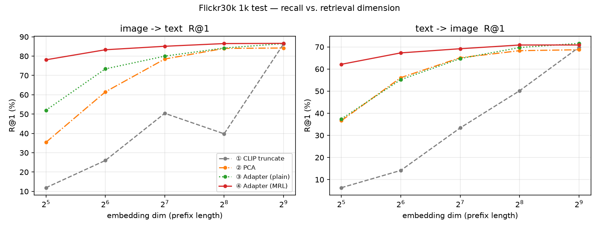
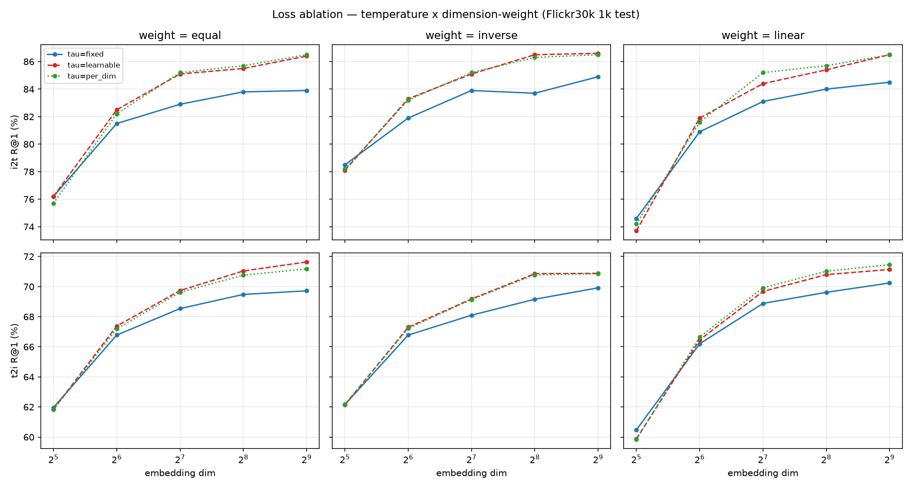
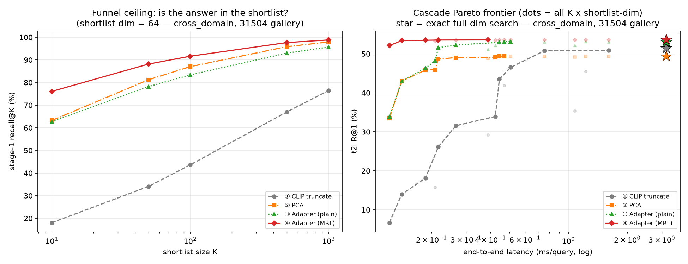
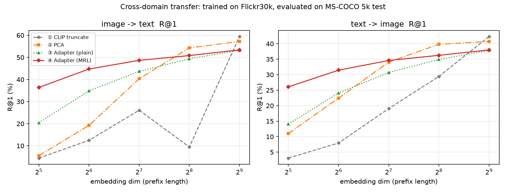
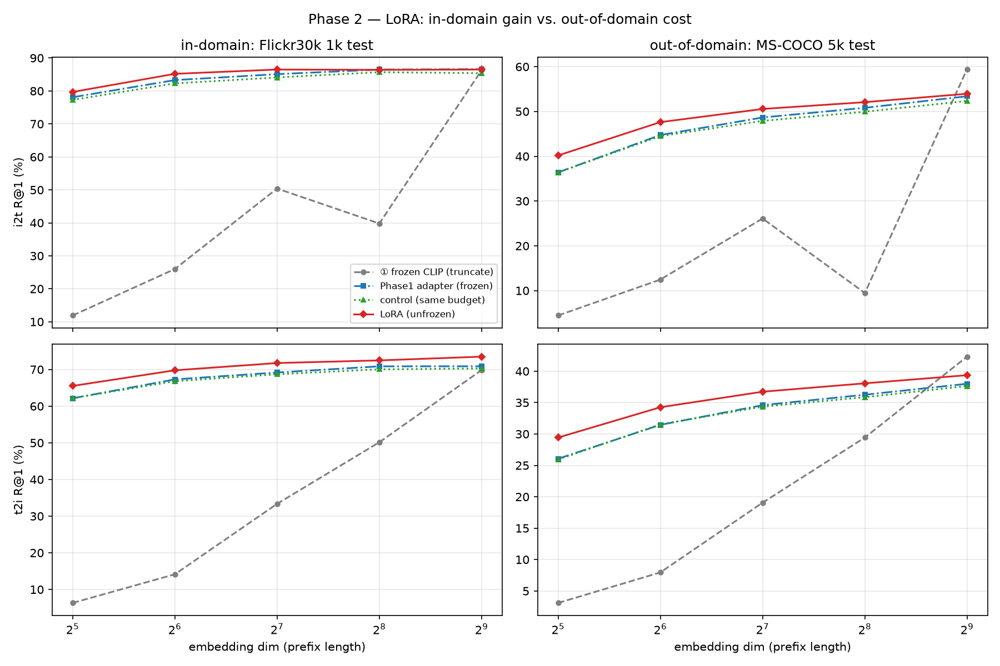
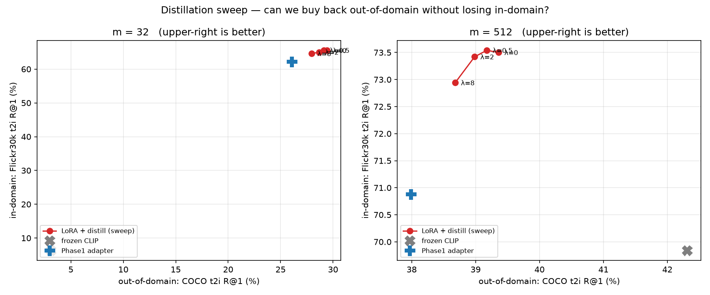

# Results

Matryoshka Representation Learning (MRL) applied to CLIP image–text retrieval. A small residual
adapter is trained with a **nested InfoNCE** loss so that *prefixes* of the embedding are
independently usable for low-dimensional retrieval — cutting latency and storage without
training a separate model per target dimension.

All numbers below were measured on the hardware in `README.md` (single RTX 4070 Laptop, 8 GB).

---

## 1. Setup

| | |
| --- | --- |
| Backbone | OpenCLIP **ViT-B/16**, `laion2b_s34b_b88k` (frozen in Phase 1) |
| Embedding dim | 512 (shared image/text space) |
| Adapter | `512 → 1024 → 512` residual MLP + LayerNorm, **shared** between towers, **1.05 M** params |
| Nested dims | M = {32, 64, 128, 256, 512} |
| Loss | Σm∈M cm · symmetric InfoNCE on the **L2-normalised prefix** `e[:m]` |
| Data | Flickr30k (Karpathy split: 29,000 / 1,014 / 1,000) · MS-COCO (Karpathy: 82,783 / 5,000 / 5,000 / restval 30,504) |

> **Order matters**: the prefix is taken **first**, then normalised. Normalising the full vector
> and then slicing gives sub-unit norms and silently wrong recall. `src/metrics.py` asserts unit norm.

### Conditions compared

| | Name | What it does | Training |
| --- | --- | --- | --- |
| ① | **Truncate** | native CLIP embedding cut to *m* | none |
| ② | **PCA** | PCA fitted on train (single projection shared by both modalities) | none |
| ③ | **Adapter-plain** | adapter trained with InfoNCE **at full dim only**, then truncated | yes |
| ④ | **Adapter-MRL** | adapter trained with the **nested** loss | yes |

③ exists to isolate the contribution of *nesting*: ③ and ④ share architecture, parameter count,
data, epochs, LR, seed, temperature mode and model-selection criterion. The only difference is
whether the loss has 1 term or 5 nested terms.

---

## 2. Baseline reproduction

Both sanity checks reproduce the official OpenCLIP numbers to the decimal
(`docs/openclip_retrieval_results.csv`), which validates the preprocessing and the i2t/t2i protocol.

| Benchmark | i2t R@1 | t2i R@1 | max deviation |
| --- | --- | --- | --- |
| Flickr30k 1k test | 86.30 | 69.84 | 0.10 pp |
| MS-COCO 5k test | 59.44 | 42.31 | 0.04 pp |

---

## 3. Main result — recall vs. retrieval dimension

Flickr30k 1k test. Parenthesised value = retention relative to that condition's own full-dim score.

**text → image R@1 (%)**

| m | ① Truncate | ② PCA | ③ Plain | ④ **MRL** |
| --- | --- | --- | --- | --- |
| **32** | 6.32 (9%) | 36.64 (53%) | 37.42 (52%) | **62.14 (88%)** |
| **64** | 14.14 (20%) | 56.10 (82%) | 55.22 (77%) | **67.30 (95%)** |
| **128** | 33.36 (48%) | 65.10 (95%) | 64.72 (90%) | **69.18 (98%)** |
| **256** | 50.16 (72%) | 68.30 (99%) | 69.72 (97%) | **70.86 (99.97%)** |
| **512** | 69.84 | 68.72 | **71.60** | 70.88 |

**image → text R@1 (%)**

| m | ① Truncate | ② PCA | ③ Plain | ④ **MRL** |
| --- | --- | --- | --- | --- |
| **32** | 11.90 | 35.40 | 52.00 | **78.10** |
| **64** | 26.00 | 61.50 | 73.40 | **83.30** |
| **128** | 50.40 | 78.50 | 80.00 | **85.10** |
| **256** | 39.80 | 84.00 | 84.20 | **86.50** |
| **512** | 86.30 | 84.20 | 86.50 | **86.60** |

- **At 64 dims MRL keeps 95% (t2i) / 96% (i2t) of full-dim recall while cutting single-query
  latency by 94%** (3.34 ms → 0.19 ms on a 31 k gallery, faiss flat, single thread).
- **At 256 dims (½ the storage, 2.2× faster) MRL matches or beats the original full-512 frozen CLIP
  on both directions** (86.50 vs 86.30 i2t, 70.86 vs 69.84 t2i).
- **Nesting is what does the work**: at m = 32, ④ beats ③ by **+24.7 (t2i) / +26.1 (i2t)** points
  under an otherwise identical setup.
- PCA is a much stronger baseline than truncation and is essentially lossless by 256 dims, but
  collapses below 64. It is also slightly *below* native at full dim (68.72 vs 69.84) because
  centring is itself lossy.

### Why the ① curve dips at m = 256 (not a bug)

Truncated i2t is **non-monotonic**: 65.60 at m = 224 → **39.80 at m = 256** → 85.20 at m = 448.
Cause: **dimension 230 is a "rogue" dimension with a severe image/text magnitude imbalance.**

| | mean | std | share of m=256 prefix energy |
| --- | --- | --- | --- |
| image side | **−4.527** | 1.065 | **25.3%** |
| text side | −0.068 | 0.267 | 0.2% |

When it enters the prefix it consumes a quarter of the image prefix energy while contributing
almost nothing on the text side; after L2 normalisation every image vector is squeezed toward that
axis and cross-modal angular resolution collapses. **Zeroing dim 230 restores m = 256 i2t to 66.00**,
back on the trend line; zeroing any other high-energy dimension changes nothing. Mean-centring is
not a fix (it makes full-dim *worse*: 86.30 → 84.30). The same collapse reproduces independently on
MS-COCO (26.10 → 9.46).

This is the sharper argument for MRL: naive truncation is not merely lossy, it is **unstable**, and
the location of the cliff is not knowable in advance. MRL and PCA curves are monotone because both
re-order the axes.

---

## 4. Loss ablation — temperature × dimension weights

Full 3×3 grid, identical seed and budget (`scripts/07_ablate_loss.py`). Mean R@1 over all dims:

| τ | cm | t2i mean | i2t mean | m=32 (i2t/t2i) | m=512 (i2t/t2i) |
| --- | --- | --- | --- | --- | --- |
| fixed | equal | 67.30 | 81.66 | 76.20 / 61.96 | 83.90 / 69.72 |
| fixed | inverse | 67.22 | 82.58 | 78.50 / 62.16 | 84.90 / 69.92 |
| fixed | linear | 67.08 | 81.42 | 74.60 / 60.48 | 84.50 / 70.24 |
| **learnable** | **equal** | **68.33** | 83.14 | 76.20 / 61.84 | 86.40 / **71.64** |
| **learnable** | **inverse** | 68.07 | **83.92** | **78.10 / 62.14** | **86.60** / 70.88 |
| learnable | linear | 67.59 | 82.38 | 73.70 / 59.88 | 86.50 / 71.14 |
| per_dim | equal | 68.12 | 83.06 | 75.70 / 61.82 | 86.50 / 71.18 |
| per_dim | inverse | 68.04 | 83.88 | 78.20 / 62.18 | 86.50 / 70.86 |
| per_dim | linear | 67.78 | 82.64 | 74.20 / 59.84 | 86.50 / 71.46 |

1. **τ must be learnable.** A fixed τ = 0.07 is last in all nine cells (≈1 pt t2i, ≈1.5–2 pt i2t
   behind). Learnable τ converges consistently to **≈ 0.055**.
2. **`per_dim` τ is a dead knob.** The five per-dimension temperatures converge to nearly the same
   value (0.0549–0.0562, a 2.4% spread), so the motivation — "each level needs its own similarity
   scale" — does not hold once nesting has done its job. Five extra parameters buy nothing; use a
   single learnable τ.
3. **cm is a clean low-dim ↔ full-dim trade-off knob**, and it behaves exactly as designed
   (an internal consistency check): `inverse` is best at m = 32 (≈+2 i2t over `equal`), `linear` is
   worst at m = 32 and best at full dim, `equal` sits in between.

Recommended: **`τ = learnable`, `c = inverse`** (now the repo default).

---

## 5. Cascade retrieval — turning the property into a latency win

Low-dim prefix retrieves a top-K shortlist, then the full-dim vectors re-rank *within* the shortlist
(`scripts/08_cascade.py`). This converts a quality-vs-cost *trade-off* into "**full-dim quality at
low-dim cost**" — but only if the prefix is a good representation, since whatever stage 1 misses
cannot be recovered.

**Stage-1 recall@K — the funnel ceiling** (shortlist dim = 32, clean 31.5 k gallery):

| K | ① Truncate | ② PCA | ③ Plain | ④ **MRL** |
| --- | --- | --- | --- | --- |
| 100 | 22.76 | 75.30 | 66.02 | **89.34** |
| 1000 | 54.42 | 95.52 | 88.28 | **98.34** |

**Cheapest configuration reaching ≥99% of exact full-dim R@1** (speed-up vs exact search):

| Gallery | ④ MRL | next best | ① Truncate |
| --- | --- | --- | --- |
| 31,014 (contains training images) | **24.0×** | 12.2× | 2.0× |
| 7,000 (clean, same-domain) | **6.24×** | 3.16× | 1.13× |
| 31,504 (clean, cross-domain distractors) | **22.4×** | 11.9× | never reaches 99% |

The absolute speed-up depends on gallery size, but **MRL ≈ 2× the best alternative** holds across
three very different galleries. Two engineering notes:

- **The binding constraint is K/N, not K.** On a 7,000-image gallery, K = 1000 (14% of N) is
  **0.38×** — *slower* than exact search, because gathering 1000 full-dim vectors by random access
  costs more than letting BLAS scan the whole library. On 31 k, K = 1000 is 3.2% of N and still gives
  ~2.9×. Optimum sits at K = 50–100.
- **Quantisation saves storage but costs latency.** At 512 dims, fp32 `IndexFlatIP` takes 0.071 ms/query
  while fp16/int8 `IndexScalarQuantizer` take 0.83/0.59 ms — flat uses BLAS, SQ decodes vector by
  vector. Dimensionality reduction saves *both*.

> **Measurement caveat**: a gallery containing images the adapter trained on inflates them into
> stronger false positives, which *depresses* the trained conditions. On the contaminated 31 k gallery
> the adapters score *below* frozen CLIP at full dim (32.12/32.18 vs 32.30); on a clean gallery the
> ordering is restored. Retention ratios are unaffected (each condition is compared against itself),
> but **absolute cross-condition R@1 must not be read off a contaminated gallery.**

---

## 6. Cross-domain transfer

Trained on Flickr30k only, evaluated on the **MS-COCO 5 k test retrieval task** (queries *and* answers
are COCO). No COCO data was seen by PCA or either adapter.

| m | ① Frozen CLIP (i2t/t2i) | ② PCA | ③ Plain | ④ **MRL** |
| --- | --- | --- | --- | --- |
| **32** | 4.44 / 3.09 | 5.50 / 11.02 | 20.42 / 14.03 | **36.40 / 26.06** |
| **64** | 12.46 / 7.95 | 19.22 / 22.43 | 34.86 / 24.09 | **44.74 / 31.45** |
| **128** | 26.10 / 19.06 | 40.34 / 34.06 | 43.64 / 30.70 | **48.66 / 34.59** |
| **256** | 9.46 / 29.43 | **54.26 / 39.81** | 49.40 / 34.91 | 50.82 / 36.25 |
| **512** | **59.44 / 42.31** | 57.26 / 40.70 | 53.22 / 37.82 | 53.40 / 37.99 |

- ✅ **The nested structure transfers.** On a dataset never seen during training, m = 32 i2t is
  36.40 vs frozen CLIP's 4.44 — an **8.2× gap**. Low-dimensional gains are not a Flickr30k artefact.
- ❌ **But full-dim general ability is damaged.** At 512 dims the adapter loses **6.0 i2t / 4.3 t2i**
  against frozen CLIP, while gaining only +0.3 / +1.0 in-domain. If you need full-dim quality across
  domains, this adapter is the wrong tool; if you need low-dim retrieval, MRL wins decisively even
  out of domain.

---

## 7. Phase 2 — LoRA on the backbone

Same nested loss, backbone unfrozen via hand-written LoRA (`src/lora.py`): r = 8, α = 16, adapting the
fused q/k/v `in_proj`, `out_proj` and both MLP projections in all 24 blocks of both towers —
**1.97 M trainable = 1.31%** of the model. fp32 weights + `autocast(fp16)` + `GradScaler`,
gradient checkpointing, batch 256, 5 epochs (~32 min).

LoRA is written by hand rather than with `peft` because OpenCLIP's attention is `nn.MultiheadAttention`
with q/k/v **fused into a single bare `in_proj_weight` Parameter** — `peft` can only reach `out_proj`
and the MLP, missing the most valuable target.

**Control** (`--set lora.towers=[]`): zero LoRA parameters, otherwise identical epochs / batch / LR /
warm start, so only the adapter trains. This isolates the contribution of unfreezing.

Full dim (512); parentheses = delta vs frozen CLIP:

| Condition | Flickr i2t | Flickr t2i | COCO i2t | COCO t2i |
| --- | --- | --- | --- | --- |
| Frozen CLIP | 86.30 | 69.84 | **59.44** | **42.31** |
| Phase-1 adapter (batch 1024 × 20 ep) | 86.60 (+0.30) | 70.88 (+1.04) | 53.40 (−6.04) | 37.99 (−4.32) |
| Control (same budget, backbone frozen) | 85.40 (−0.90) | 70.28 (+0.44) | 52.36 (−7.08) | 37.63 (−4.68) |
| **LoRA (unfrozen)** | 86.50 (+0.20) | **73.50 (+3.66)** | 53.96 (−5.48) | 39.36 (−2.95) |

- **Unfreezing helps consistently on both datasets at every dimension.** Net contribution isolated by
  the control: Flickr30k **+1.10 i2t / +3.22 t2i**, COCO **+1.60 / +1.73**; larger at low dims
  (m = 32: Flickr +2.40 / +3.34, COCO +3.78 / +3.50).
- **A smaller budget beat Phase 1**: batch 256 × 5 epochs outperformed batch 1024 × 20 epochs with a
  frozen backbone.
- LoRA also **narrowed** the out-of-domain gap (COCO t2i −4.32 → −2.95) rather than widening it.

### Distillation regulariser — a negative result

An anti-forgetting term pulling the backbone output back toward the original CLIP embedding
(targets read straight from the cached frozen features, so it is nearly free), swept over
λ ∈ {0, 0.5, 2, 8}. t2i R@1 (%):

| λ | m=32 Flickr | m=32 COCO | m=512 Flickr | m=512 COCO | distill term (ep 5) |
| --- | --- | --- | --- | --- | --- |
| **0** | 65.52 | **29.43** | 73.50 | **39.36** | — |
| 0.5 | **65.56** | 29.11 | **73.54** | 39.18 | 0.0383 |
| 2 | 65.02 | 28.68 | 73.42 | 38.98 | 0.0225 |
| 8 | 64.60 | 27.96 | 72.94 | 38.68 | 0.0098 |

Larger λ makes **both** domains monotonically worse; nothing is bought back. The regulariser *works*
mechanically — the drift term is suppressed 4× from 0.0383 to 0.0098 — but **drift was never the
cause**: d = 0.0383 means the tuned backbone still has cosine ≈ **0.981** with the original, and in
Phase 1 the backbone was untouched (cosine exactly 1.0) yet the COCO gap was already −6.04 / −4.32,
*larger* than LoRA's.

> **The full-dim out-of-domain loss comes from the adapter's domain specialisation, not from backbone
> drift. The regulariser was applied to the wrong component.**

This is also **not classical overfitting** — validation recall rose monotonically to the last epoch
(77.95 → 78.67) and never turned down.

---

## 8. Open problem

The full-dim out-of-domain gap (≈5.5 pt COCO i2t) is unresolved. Three directions, in order of
information gained:

1. **Constrain the adapter output instead of the backbone**:
   `L = L_MRL + λ·(1 − cos(adapter(e), e_orig))`. This does not conflict with MRL's objective — MRL
   needs the *prefixes* to be good, not the full-dim vector to move — so it amounts to "keep the
   512-d vector where CLIP put it, only redistribute information across the dimension ordering".
2. **Train the adapter on more diverse data.** Best at explaining *why* the gap exists (domain
   overfitting vs. an intrinsic cost of nesting). Requires holding out a third dataset as the
   out-of-domain probe, since training on COCO would destroy COCO's role as one.
3. **Accept it.** At m = 32 out of domain, MRL is 8.2× frozen CLIP. If the use case is low-dimensional
   retrieval the full-dim regression is never exercised; it only matters if you claim to be a drop-in
   replacement at full dimension.

> **Scale caveat**: frozen CLIP saw ~2 billion image–text pairs; this fine-tunes on 29,000 images.
> Adding a few datasets cannot match that coverage. The question is not whether the gap can be closed
> but whether more diverse data makes the nesting transfer better.

---

## Caveats

- Single seed throughout, no error bars. The 2–3 point effects reported for LoRA are large relative to
  typical run-to-run variance on a 1,000-image test set, but multi-seed replication has not been done.
- Latency has ~20% cross-run measurement noise (the same 256-dim configuration measured 1.25–1.51 ms
  across runs). Compare dimension scaling **within** a single run, not absolute values across runs.
- Cascade recall is measured on a 31 k gallery and is **not** comparable to the 1 k-test literature
  numbers; it is only used for within-gallery comparisons between conditions.
